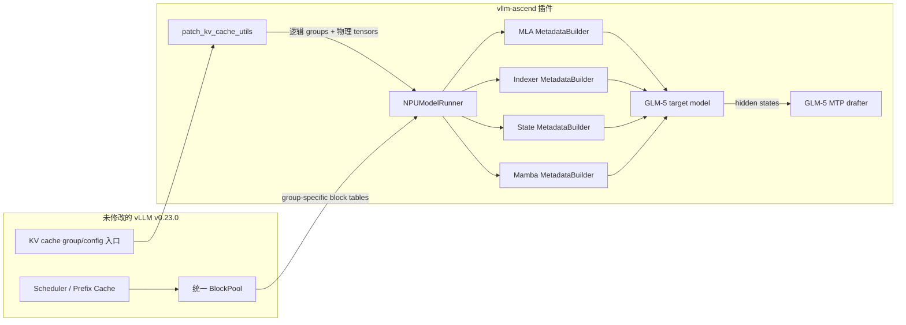
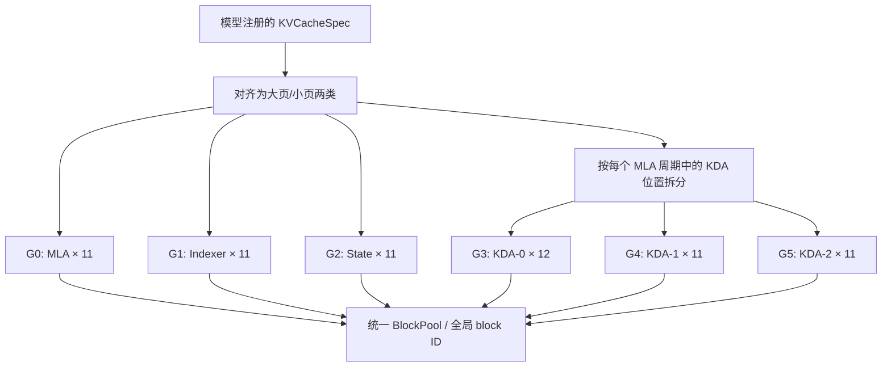
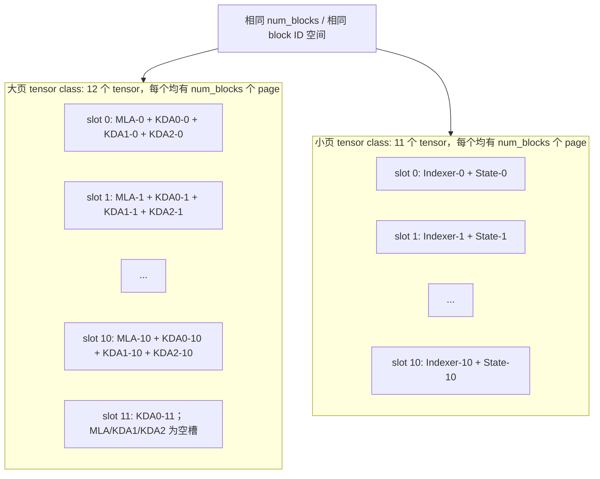
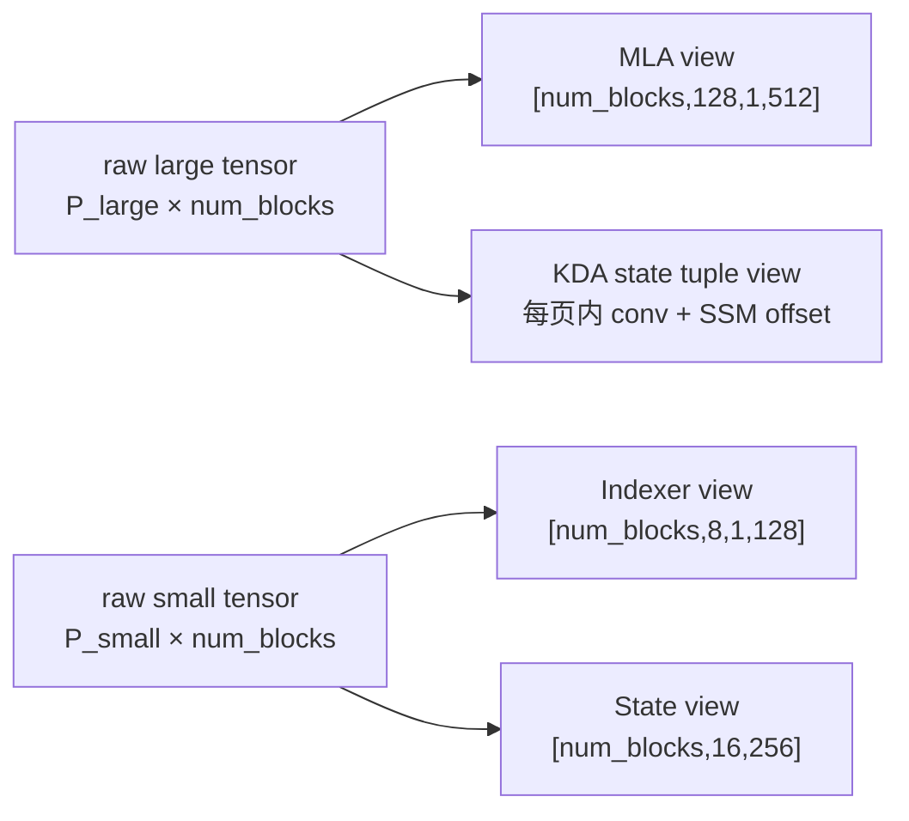
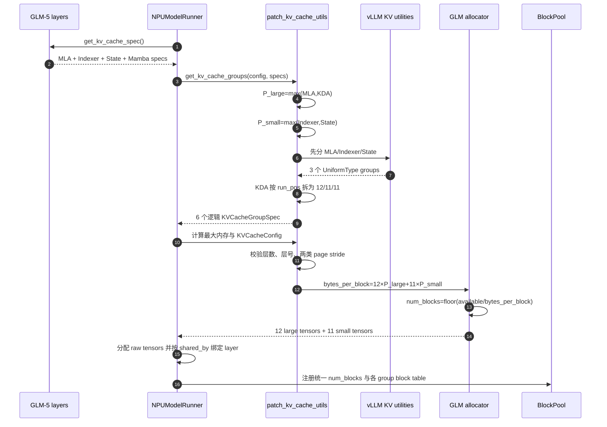
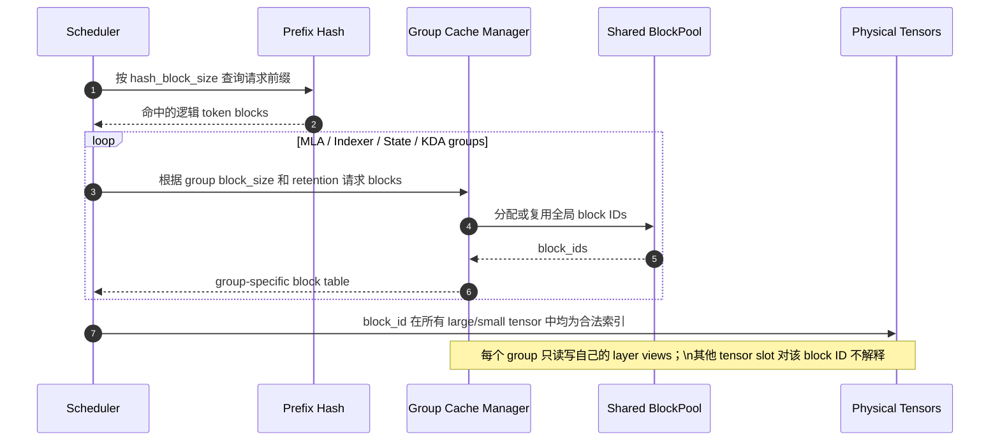
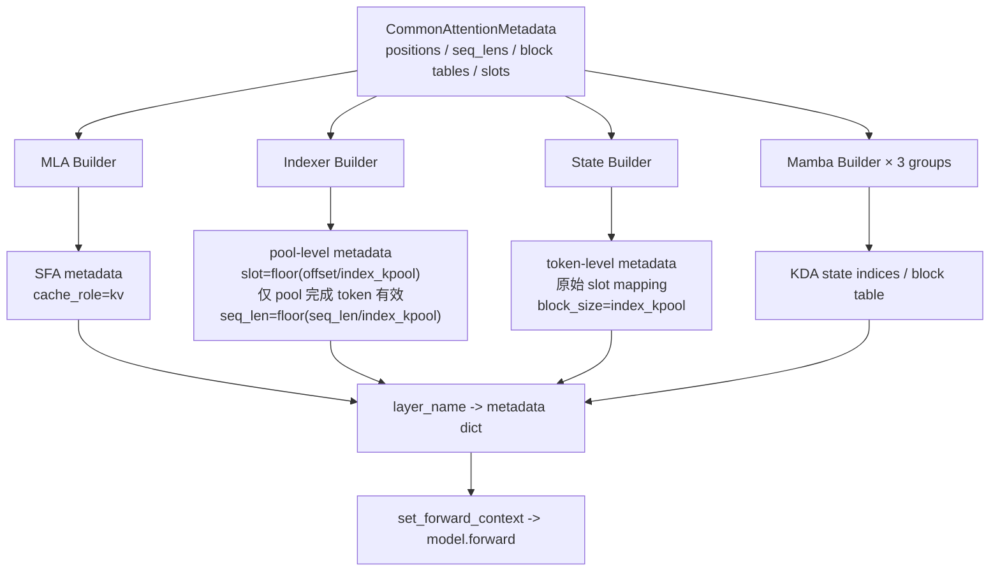
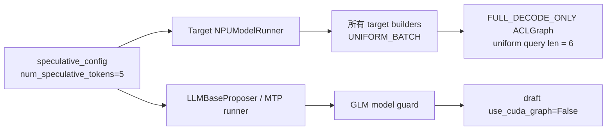
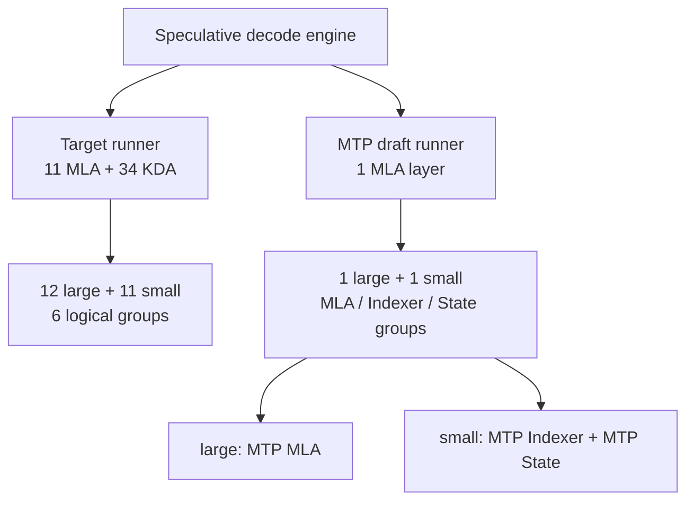
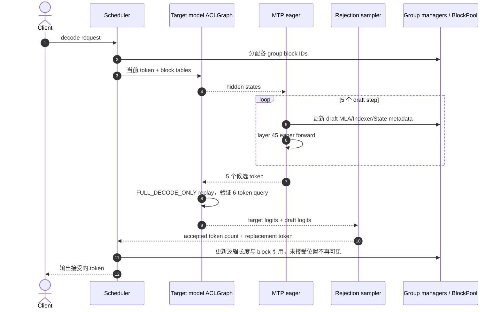

# GLM-5-Next KV Cache 与 MTP 设计

## 1. 文档范围

本文描述 GLM-5-Next 在 Ascend 上的以下实现：

- 11 层 MLA、34 层 KDA 的逻辑 KV cache 分组；
- MLA/KDA 与 Indexer/Compressor State 两类物理 tensor；
- 全局 block ID、Prefix Cache 与各 cache group 的关系；
- 主模型 `FULL_DECODE_ONLY` ACLGraph；
- MTP draft runner 的独立 cache 和五步 metadata 构造；
- 物理内存计算、padding、空槽和失效 slot 的处理。

运行边界是未经修改的上游 vLLM v0.23.0。所有适配位于
`vllm-ascend` 插件和 monkeypatch 中，不依赖上游参考仓的本地修改。

## 2. 设计目标

1. 保留 vLLM 的统一 `BlockPool` 和 Prefix Cache 语义。
2. 允许 MLA、KDA、Indexer KPool 和 Compressor State 使用不同逻辑 block size。
3. 只要求共享同一物理 tensor 的 cache 具有相同物理 page stride。
4. 大页和小页使用相同 `num_blocks`，但不要求两类 page size 相同。
5. 主模型支持 `FULL_DECODE_ONLY`；GLM MTP draft runner 保持 eager。
6. MTP 五步不产生动态地址，且每个 cache group 使用独立 slot mapping。

## 3. 模型与 cache 清单

主模型共有 45 层，按 `KDA, KDA, KDA, MLA` 周期排列，最终得到 34 层
KDA 和 11 层 MLA。每个 MLA 层还拥有一个 Indexer K cache 和一个
Compressor State cache。

| Cache 角色 | Spec | 层数 | 逻辑 block size | 典型未对齐 page 大小 |
| --- | --- | ---: | ---: | ---: |
| MLA latent KV | `MLAAttentionSpec(compress_ratio=1)` | 11 | 128 | `128 × 1 × 512 × 2 = 131072 B` |
| Indexer KPool | `MLAAttentionSpec(compress_ratio=index_kpool)` | 11 | 128 | `8 × 1 × 128 × 2 = 2048 B`，以 `index_kpool=16` 为例 |
| Compressor State | `AscendIndexerKPoolStateSpec` | 11 | 16 | `16 × 256 × 2 = 8192 B` |
| KDA state | `MambaSpec` | 34 | 由 Mamba 配置决定 | MTP 关闭时典型为 `271360 B` |

这里的 MLA 配置满足 `qk_rope_head_dim=0`，因此 MLA cache 只保存 512 维
latent，不再存在额外的 64 维 RoPE cache 尾部。

### 3.1 两种容易混淆的 tail

- Indexer Compressor State 保存最近一个 kpool 内尚未压缩的 K/Gate 状态。
  它的 block size 是 `index_kpool`，典型值为 16；无效 slot 使用 `-1`。
- KDA conv state 的历史长度是
  `conv_kernel_size - 1 + num_speculative_tokens`。当卷积核为 4 时，MTP
  关闭为 3，MTP 五步为 8。因此“tail 永远是 3”并不成立。

## 4. 总体架构



插件只覆盖运行时实际存在的 KV allocator 入口：
`_get_kv_cache_config_deepseek_v4` 或 `_get_kv_cache_config_packed`。这样不需要
修改上游 vLLM，也不会依赖某个参考分支对函数名的假设。

## 5. 逻辑 cache group

逻辑 group 决定 block table、cache manager 和请求级 block 生命周期，不等同于
物理 tensor 数量。



34 层 KDA 无法平均分成三个 11 层 group。按照模型层序，第一组包含最后一层
KDA，因此分组固定为 `[12, 11, 11]`。`UniformTypeKVCacheSpecs` 包装所有
group，避免上游回退到要求全局统一 page size 的旧分配路径。

## 6. 两类物理 tensor

### 6.1 Page size 对齐

```text
P_large = max(real_page(MLA), real_page(KDA))
P_small = max(real_page(Indexer), real_page(Compressor State))
```

在典型 BF16、MLA block size 128、`index_kpool=16` 配置中：

| 模式 | `P_large` | `P_small` |
| --- | ---: | ---: |
| MTP 关闭 | `271360 B` | `8192 B` |
| MTP 五步 | `286720 B` | `8192 B` |

MTP 五步时 KDA conv state 从 3 个位置扩展到 8 个位置，所以大页增大；小页不受
MTP 步数影响。

### 6.2 主模型物理槽位



`shared_by` 表示不同逻辑 group 的 layer 将同一个 raw tensor 作为地址空间，
并不表示同一个 block ID 同时存放多种语义。一个 block ID 在某一时刻由一个
逻辑 group 分配；该 group 只解释与自己对应的 tensor slot，其余物理槽位对该
block ID 是空间开销。

### 6.3 物理视图

Runner 先按 `KVCacheTensor.size` 分配一维 raw tensor，再根据每个 layer spec 的
`page_size_padded` 创建带 stride 的视图。KDA 的 conv/SSM state 在每个物理 page
内使用不同 offset，不能按“所有 conv blocks + 所有 SSM blocks”的连续平面布局，
否则一个 KDA block 会跨入其他全局 block ID 的 page：



不同视图的有效数据大小可以不同，但相邻 block 的物理 stride 必须等于所属
page class 的 page size。

## 7. 分组和分配启动时序



### 7.1 内存公式

主模型每个全局 block ID 的物理成本为：

```text
bytes_per_block = 12 × P_large + 11 × P_small
num_blocks = floor(available_memory / bytes_per_block)
```

MTP 关闭时典型值为：

```text
12 × 271360 + 11 × 8192 = 3346432 B/block
```

MTP 五步 target 为：

```text
12 × 286720 + 11 × 8192 = 3530752 B/block
```

最大模型长度估算不能只计算 tensor 数量，还要计算每个逻辑 group 的 block
需求：

```text
blocks_needed = Σ group.max_memory_usage_pages(vllm_config)
max_memory = blocks_needed × bytes_per_block
```

该求和包含 MLA、Indexer、State、三个 KDA group，以及 KDA 为五步推测预留的
`num_speculative_blocks=5`。

### 7.2 Padding 与空槽开销

物理共享换取统一 block pool 和 Prefix Cache 兼容性，同时引入两类开销：

1. page 内 padding，例如 MLA `131072 B` 对齐到 KDA 大页；Indexer `2048 B`
   对齐到 State 小页。
2. group 空槽，例如 KDA-1、KDA-2 和 MLA group 都不使用第 12 个大页 slot。

更精确的 group 级浪费计算为：

```text
waste(group) = blocks(group) ×
               (bytes_per_block - Σ real_page_size(group layers))
```

因此不能只用“层数 × padding”估算总浪费；不同 group 的实际 block 数由请求、
Prefix Cache 命中和 Mamba retention 策略共同决定。

## 8. Prefix Cache 与 block 生命周期



不同 group 可以拥有不同逻辑 block size。启用 CP 时 scheduler block size 使用各
group block size 的 LCM；Prefix Cache hash 粒度使用 GCD。物理 tensor 的
`num_blocks` 始终统一，所以任意 group 从全局池取得的 block ID 都不会越界。

## 9. 主模型 metadata 构造

Runner 先构造一份 `CommonAttentionMetadata`，再为每个 KV cache group 替换相应
的 block table、slot mapping 和序列长度，并调用该 group 内 backend 的 builder。



### 9.1 Indexer slot 变换

Indexer 只在一个 kpool 完整结束时写入压缩 cache：

```text
valid = slot >= 0 and (position + 1) % index_kpool == 0
compressed_slot = block_id × (logical_block_size / index_kpool)
                  + floor(block_offset / index_kpool)
invalid -> -1
```

Compressor State 则保存当前未完成 pool 的逐 token 状态，所以沿用原始 token slot。

### 9.2 ACLGraph 地址稳定性

Indexer builder 在初始化时预分配 `_slot_mapping_buffer` 和 `_seq_lens_buffer`，每轮
只通过 `copy_` 或带 `out=` 的算子更新内容，不替换地址。三个 GLM cache builder
均返回 `AttentionCGSupport.UNIFORM_BATCH`，因此不会在 capability 归约时把主模型
`FULL_DECODE_ONLY` 降级为 `NONE`。

## 10. 主模型图与 MTP eager 的边界



MTP 配置存在时，target 一次验证原 token 加五个 draft token，因此 uniform decode
query length 为 6。主 MLA 稀疏 attention 根据累计 query length 计算每个 query
的 causal limit，支持多 token 验证；不能再因为 `speculative_config` 存在而返回
`AttentionCGSupport.NEVER`。

draft runner 仍明确设置 `use_cuda_graph=False`。这条 guard 只作用于 proposer，
不会修改 target runner 的 graph mode。

### 10.1 图内 cache 写入

FULL graph 使用固定长度 slot tensor。无效 slot 不能通过动态 `nonzero()` 改变
shape，处理方法为：

1. 将无效 slot 映射到 row 0；
2. 保存 row 0 原值；
3. 通过固定形状 tensor indexing 写入；
4. 恢复 row 0 的正确值。

该路径不调用 `torch_npu.npu_scatter_nd_update_`，避免 graph 编译依赖旧 CANN
`libopapi.so` 中不存在的 `aclnnScatterNdUpdateV2`。eager 路径仍可通过动态有效行
过滤减少无效写入。

## 11. MTP cache 架构

实际运行时 target 和 draft 是两个 runner，各自拥有 KVCacheConfig 和物理 tensor。



因此：

- target 内仍是 11 个 Indexer/State 小页槽；
- draft runner 额外提供第 12 层 MTP 对应的 1 个小页槽；
- 只有在“合并观察两个 runner 的模型语义”时，才可以说共有 12 个
  Indexer/State 页；它们不是同一个 raw tensor allocation。

MTP draft 没有 KDA，因此其大页只需容纳 MTP MLA；小页仍按
`max(Indexer, State)` 对齐。

## 12. MTP 五步 metadata 时序

Proposer 为每个 draft step 和每个 cache group 都保存独立的持久化 buffer：

```text
slot_mapping_group[draft_index]
_slot_mapping_group_by_gid[kv_cache_group_id][draft_index]
seq_lens_group[draft_index]
query_start_loc_group[draft_index]
```

```mermaid
sequenceDiagram
    autonumber
    participant Target as Target runner (graph)
    participant Prop as LLMBaseProposer (eager)
    participant BT as Draft group block tables
    participant MB as MLA builder
    participant IB as Indexer builder
    participant SB as State builder
    participant MTP as MTP layer 45

    Target->>Prop: target hidden states + sampled token
    loop draft_index = 0..4
        Prop->>Prop: position += 1; seq_len += 1
        loop MLA / Indexer / State cache group
            Prop->>BT: 读取该 group 的 block_size 与 block table
            BT-->>Prop: block_id
            Prop->>Prop: 写入 buffer[gid][draft_index]
            Prop->>MB: build_for_drafting(common, draft_index)
            Prop->>IB: build_for_drafting(common, draft_index)
            Prop->>SB: build_for_drafting(common, draft_index)
        end
        Prop->>MTP: forward(spec_step_idx=draft_index)
        MTP->>MTP: current_step_idx = draft_index % 1 = 0
        MTP-->>Prop: draft hidden states / logits
    end
    Prop-->>Target: 五个 draft token
    Target->>Target: graph 验证 1 + 5 个 token
```

每个 group 必须使用自己的 block size 计算：

```text
logical_block = floor(position / group.block_size)
block_id = group.block_table[request, logical_block]
slot = block_id × group.block_size + position % group.block_size
```

不能用 MLA 的 block size 复用到 Indexer 或 State，否则会写入错误的物理 page。

当前模型只有一个 MTP layer，因此五个 step 都通过
`spec_step_idx % num_mtp_layers` 复用 layer 45。KDA target cache 同时通过
`num_speculative_blocks=5` 和扩展后的 conv state shape 为五步验证预留空间。

## 13. 一轮 speculative decode 总时序



## 14. 关键不变量与失败保护

| 不变量 | 保护方式 |
| --- | --- |
| 每个 MLA 层恰好一个 Indexer 和一个 State | 校验三组层数和 layer index 完全一致 |
| 大页内所有 layer stride 相同 | 校验 MLA/KDA `page_size_bytes` 集合大小为 1 |
| 小页内所有 layer stride 相同 | 校验 Indexer/State `page_size_bytes` 集合大小为 1 |
| 所有物理 tensor 使用相同 block ID 范围 | allocator 对所有 tensor 使用同一个 `num_blocks` |
| KDA 分组完整 | 按模型注册顺序和 KDA run position 构造 `[12,11,11]` |
| MTP 每个 group 独立寻址 | `_slot_mapping_group_by_gid[gid][draft_index]` |
| graph replay 地址稳定 | builder 预分配 buffer，运行时只原地更新 |
| padding slot 不污染 cache | `-1` sentinel；图内映射 row 0 后恢复 |
| target graph 不被 MTP 误关闭 | target builders 返回 `UNIFORM_BATCH`；仅 draft 强制 eager |

## 15. 测试覆盖

`tests/ut/models/test_glm5_next_indexer_kpool_mla.py` 覆盖：

- 两类 page size 对齐；
- 34 层 KDA 的 `[12,11,11]` 分组；
- target 的 12 large + 11 small tensor；
- 合并模型语义时 MTP 第 12 个 Indexer/State 页；
- standalone MTP runner 的 1 large + 1 small tensor；
- MTP 五步 target 的 KDA page 扩展；
- group-aware 最大内存估算；
- speculative config 存在时 target builder 仍支持 uniform graph；
- FULL graph 不调用 `npu_scatter_nd_update_`；
- MLA/Indexer padded page 的图内写入按物理 page stride 寻址；
- sparse attention 从非连续 padded MLA cache 读取时不执行展平 `view()`。

`tests/ut/models/test_glm5_next_mtp.py` 覆盖：

- 单 MTP layer 连续复用五步；
- KDA conv state 为五步从 3 扩展到 8；
- 五步下 KDA raw state 典型大小为 `286720 B`。

`tests/ut/worker/a2/test_model_runner_v1.py` 覆盖：

- MLA 大页和 Indexer 小页均使用物理 `page_size_padded` 作为 block stride；
- payload view 的 shape 保持真实 cache shape，相邻 block 地址差等于物理 page
  size；
- KDA conv/SSM state 使用相同 page stride 和不同 page offset，不跨越其他
  block ID 的物理 page。

## 16. 已知限制与后续演进

1. GLM MTP draft runner 当前不入 ACLGraph；只有 target 主模型使用
   `FULL_DECODE_ONLY`。
2. 两类 tensor 方案优先保证统一 BlockPool 和 Prefix Cache 语义，不能消除跨
   group block ID 带来的全部物理空槽。
3. `shared_by` 依赖 layer 注册顺序和 layer index 校验；新增 cache role 时必须扩展
   `_get_glm5_cache_layout`，不能静默混入现有 page class。
4. 真实 ACLGraph、Prefix Cache 命中和 MTP 五步需要在目标 CANN/NPU 环境进行
   端到端验证；CPU 单测只能证明布局和 metadata 变换契约。

## 17. 代码索引

| 逻辑 | 文件 |
| --- | --- |
| 两类 page 对齐、逻辑分组、物理分配、内存估算 | `vllm_ascend/patch/platform/patch_kv_cache_utils.py` |
| Mamba/KDA page size 计算 | `vllm_ascend/patch/platform/patch_mamba_config.py` |
| MLA/Indexer/State backend 与 metadata builder | `vllm_ascend/attention/indexer_kpool_mla_v1.py` |
| Indexer compressor、图内 cache 写入 | `vllm_ascend/models/glm5_next.py` |
| target metadata 汇总、tensor 分配与 layer 绑定 | `vllm_ascend/worker/model_runner_v1.py` |
| MTP 五步 group metadata | `vllm_ascend/spec_decode/llm_base_proposer.py` |
| 单层 MTP 五步复用 | `vllm_ascend/models/glm5_next_mtp.py` |
